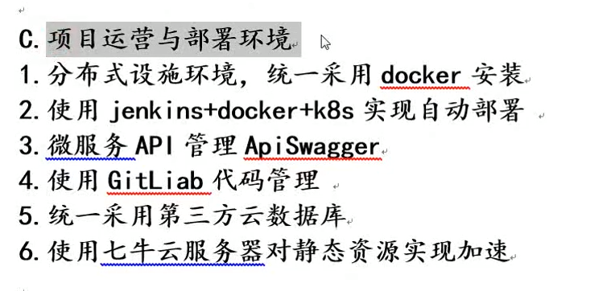
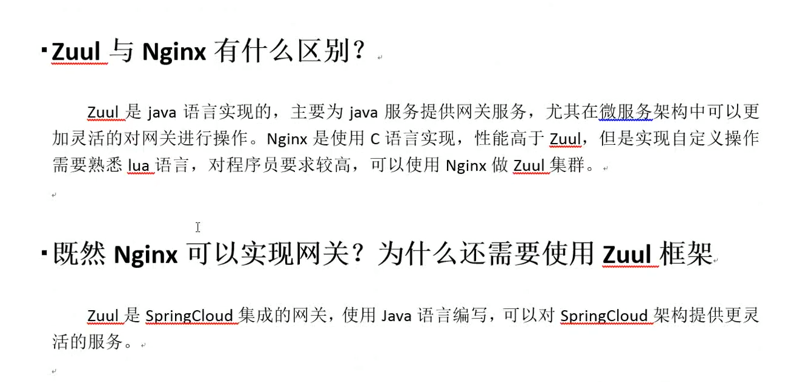

# 相关说明

# 微服务电商的技术选型

#### A.你们项目为什么使用springboot开发？

##### 答：敏捷开发，快速整合第三方框架。简化XML配置，采用全注解化。内置Http服务器。通过java部署运行。

### A2、你们项目为什么要用SpringCloud开发？

#### 1.为什么还用eureka（U re ka）来开发，它现在都闭源了？还有其它框架做注册中心选择吗？

#### 答：有，consul、nacos、zk.....。闭源就相当于它不会去开放源代码了。

1.2 Nginx与Ribbon的区别？

答：Nginx是通过Nginx服务器，根据自己的策略去分配到不同的服务器上。Ribbon是通过客户端负载均衡，从注册中心上读取服务绑定的服务器，同一个服务多个服务器，然后客户端通过轮询去访问不同服务器。

#### 2.Zuul是第一代网关，gateway是第二代网关。你们项目为什么要去使用到网关？

##### 答：统一管理微服务请求，它能帮助我们的限流安全、日志控制、负载均衡、路由转发。

#### 2.2、Ngnix可以实现网关？为什么还需要使用Zuul框架？

##### 答：因为Zuul框架是java语言编写，对一些自定义改动比较方便，对springcloud框架提供更灵活的服务。而Ngnix是c语言编写，对程序员要求比较高。

### 3、Ribbon和Ngnix的负载均衡有什么区别？

#### 答：Ribbon本地负载均衡（从注册中心查找服务对应的服务器，轮询去访问同一服务的不同服务器）。Ngnix服务器负载均衡（使用策略模式分发请求到不同服务器上）。

### B1、为什么要使用XXl-JOB来进行任务调度？

#### 答：统一管理整个微服务的job的管理，统一的集群管理。  

# 项目架构

# 面试微服务问题

# 环境要求

