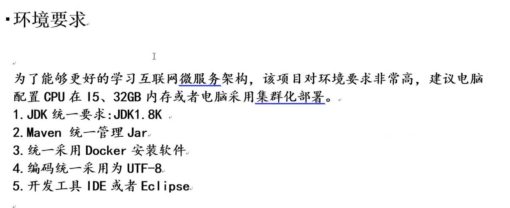
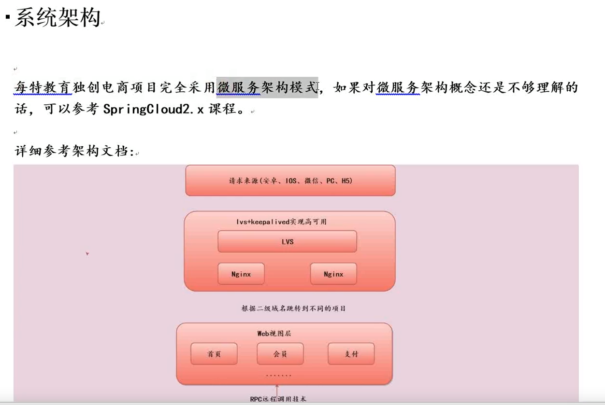
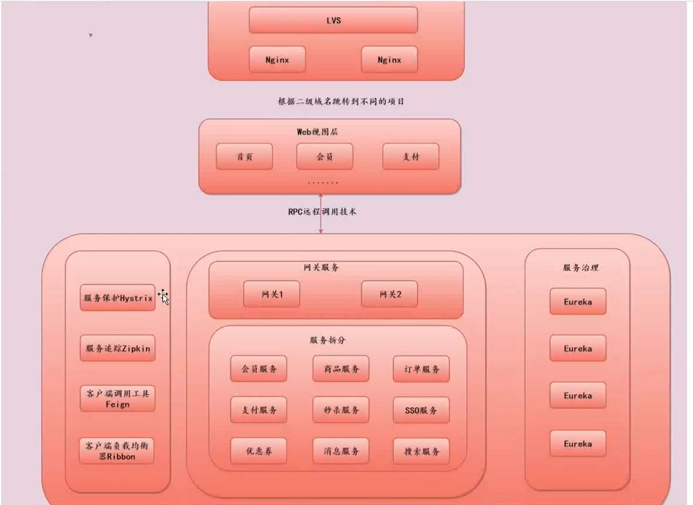
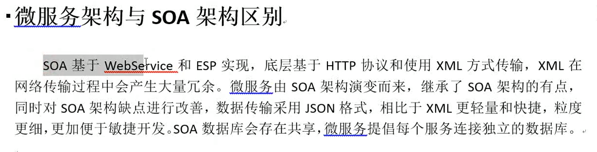

# 环境要求

# 系统架构

### 1、右侧eureka为什么要做集群？同一个eureka应用，部署到多台服务器上？

#### 答：保持服务治理的高可用行！如果只有一台，然后宕机了，左中侧的服务都需要eureka的支持，都会死掉。

2、web视图层是前段，不是微服务。发送请求的时候会先通过网关服务，统一管理微服务的入口，配置了一些安全策略，通过了安全策略才会转发到下面一些服务调用。

3、网关为什么要搭建集群？

答：集群都是高可用！如果只有一个网关，宕机后，就无法访问微服务了。

4、左侧是springcloud一些插件组件。

​	Hystrix：用于服务降级、熔断、隔离、限流。

​	Zipkin：监控服务与服务之间的依赖关系。并且有一个这样的系统可以查询到。

​	Feign：比如支付服务想调用优惠券的服务，就需要Feign来跨服务调用。

​	Ribbon：客户端负载均衡。

5、微服务架构与 SOA 架构有什么区别？

答：两点 ---- 1、SOA 采用 HTTP 协议 与 XML 方式传输，XML在网络传输中会产生大量冗余。微服务由 SOA 演变而来，继承了 SOA 优点，采用 json 格式传输， 比 XML 轻量快捷，粒度更细，便于敏捷开发。

​					   2、SOA 采用数据库共享（只有一个数据库wfwzhxg）；微服务提倡每个服务连接独立的数据库。（wfwzhxg、wfwgyxt、wfwyxxt）

如果对springcloud架构不熟悉的话，可以登录蚂蚁课堂免费观看。 

# 搭建架构的时候，要支持多来源

